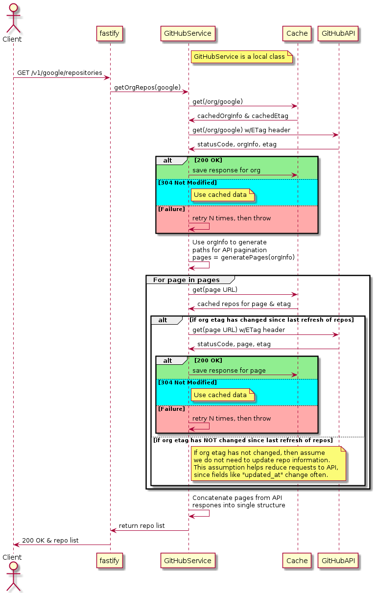

# GitHub Org Microservice

Sample microservice to fetch, cache, and serve information about GitHub organizations and their public repos.

- [GitHub Org Microservice](#github-org-microservice)
  - [MVP Design Intent](#mvp-design-intent)
    - [Context](#context)
    - [Endpoint Definition](#endpoint-definition)
    - [Basic Data Flow](#basic-data-flow)
  - [Decision Log](#decision-log)

## MVP Design Intent

The `GitHub Org Microservice` is intended to be a proof-of-concept (PoC) for building a small service that caches public repository listing for an organization of GitHub.
[Fastify](https://www.fastify.io/) is used as the web framework for this PoC.

### Context

We wish to serve information about public repositories in a GitHub organization. Hopefully, we can do this at the lowest cost for ourselves and GitHub's API.

GitHub performs [rate limiting](https://docs.github.com/en/rest/overview/resources-in-the-rest-api#rate-limiting) on its public APIs.
Luckily, ETags are provided to enable [conditional requests](https://docs.github.com/en/rest/overview/resources-in-the-rest-api#conditional-requests) and enable cache use. Thus, we will use a cache to keep a local copy of API results.

Google is the target organization for this PoC, and its scale presents several considerations...

- Repositories are updated often.
- Repositories are added/removed frequently.
- Repositories are numerous enough to require several pages from the paginated API.

Individual repositories are updated often, although their names are updated infrequently.
Thus, we assume that cached repository information will remain relevant until an organization's ETag changes (at which point it becomes stale).
This assumption will save us from making unnecessary requests to the API.

### Endpoint Definition

Two endpoints will be exposed by our microservice...

| Route                                | Description                              | Return Sample                                 |
| ------------------------------------ | ---------------------------------------- | --------------------------------------------- |
| `GET /v1/{org}/repositories`         | Get repository info for an organization. | `[{"name": "repo1"}, ..., {"name": "repoN"}]` |
| `PUT /v1/{org}/repositories/to_file` | Save repository info in `/tmp`           | `201 Created`                                 |

### Basic Data Flow

The following diagram depicts an abstract description of how data flows throughout the system when a client makes a request to the `GET /v1/{org}/repositories` endpoint.

The `PUT /v1/{org/repositories/to_file` endpoint has a very similar data flow. Instead of returning the repository list to the client, the server simply save the data locally and returns `201 Created`. (The author will leave making a corresponding diagram as an exercise for the reader.)

## Decision Log

| Decision                                                     | Brief Description                                        |
| ------------------------------------------------------------ | -------------------------------------------------------- |
| [Fasitfy used as server framework](docs/adr/0001-fastify.md) | Fastify provides us with a lightweight web framework.    |
| [GitHub Actions for CI/CD](docs/adr/0002-github-actions.md)  | GitHub actions will be used for all CI/CD related tasks. |
